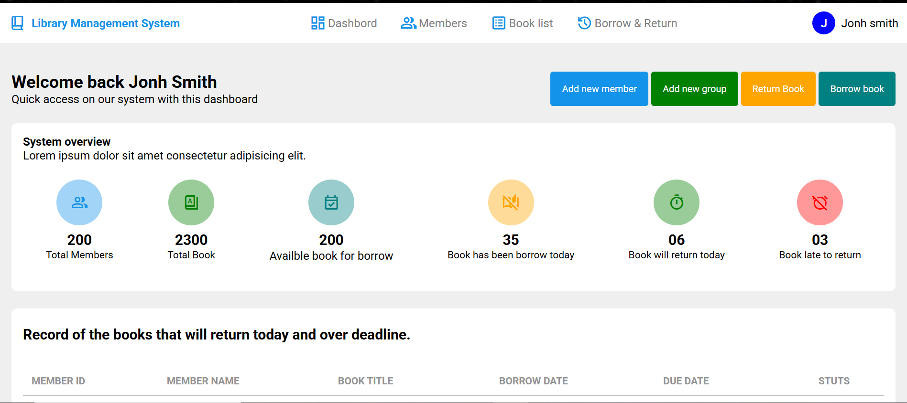
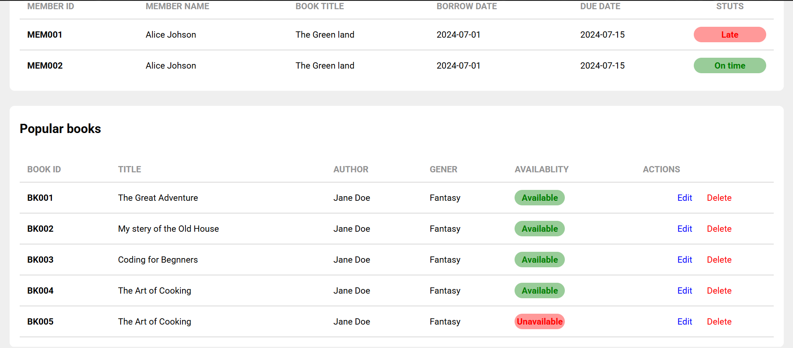

## 🚀 Features

- 📖 Add, update, and delete books
- 👤 Register and manage users
- 📅 Borrow and return books
- 🔍 Search books by title, author, or ISBN
- 📊 View borrowed books and due dates
- 🛡️ User role system (Admin, Librarian, Member)

---

## 🛠️ Tech Stack

- **Frontend**: HTML, CSS, JavaScript
- **Backend**: Python (Flask/Django) / Node.js / PHP
- **Database**: SQLite / MySQL / MongoDB


---

## 📦 Installation

1. **Clone the repository**
   ```bash
   git clone https://github.com/yourusername/library-system.git
   cd library-system

## 📸 Screenshot
Here is what the Library System looks like:

